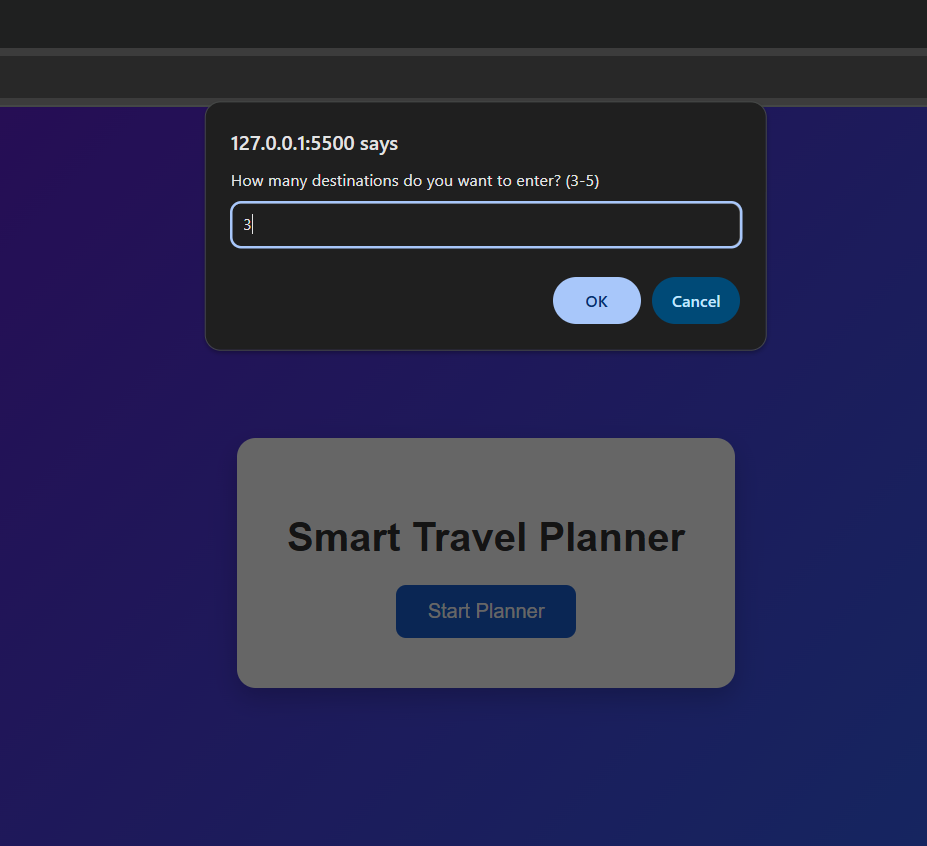
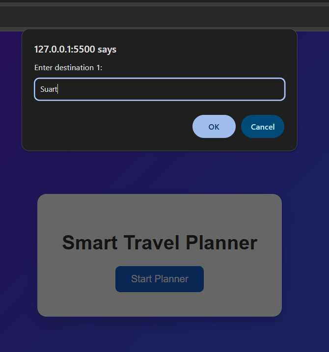
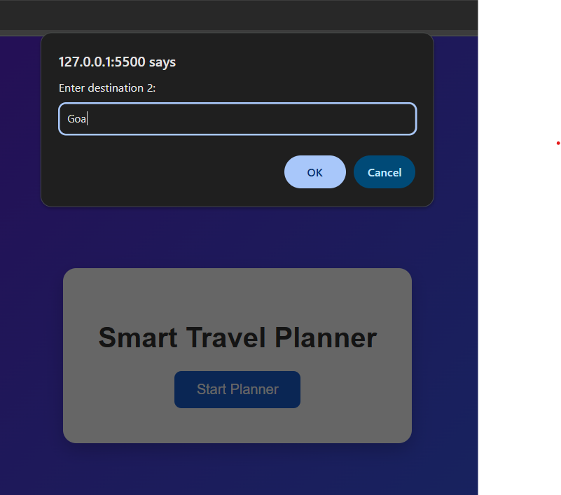
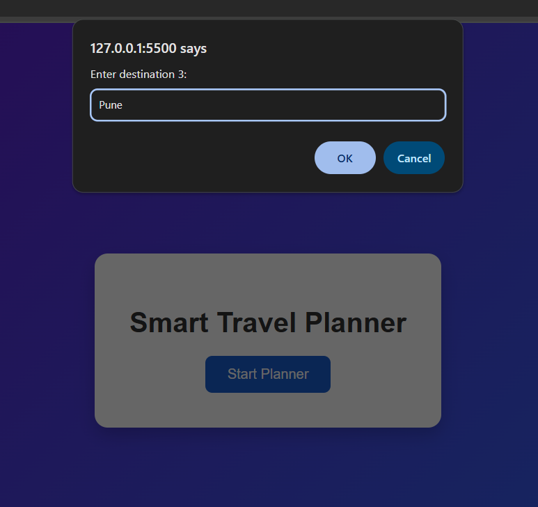
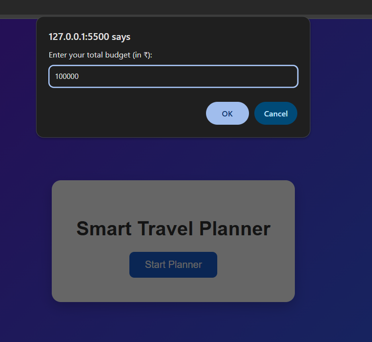
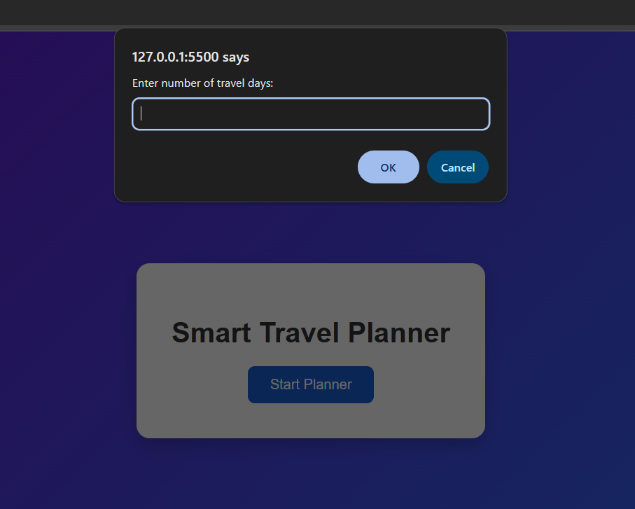
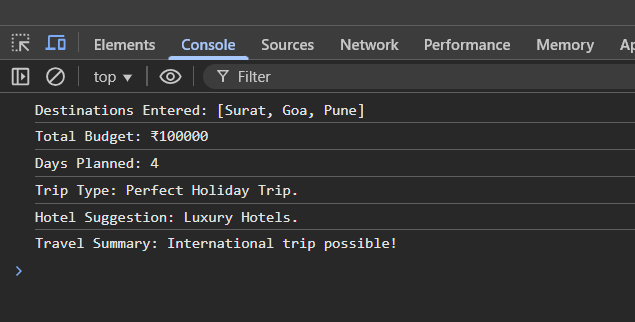

# 🌍 Smart Travel Planner

## 📌 Project Definition
Smart Travel Planner is a **JavaScript-based mini project** that helps users plan their travel by taking inputs like destinations, budget, and number of travel days. The app then suggests the **trip type** and **hotel category** based on the given data.

---

## 🎯 Objective
- To create a travel planner using JavaScript fundamentals.  
- Use **arrays, loops, functions, ES6 features, and condition statements**.  
- Display the **final summary** clearly in the console.  

---

## 🧩 Project Flow
1. **🌍 Input Travel Destinations**  
   - User enters 3–5 destinations.  
   - Destinations stored in an array.  

2. **💰 Budget Check**  
   - If budget < ₹10,000 → Short Domestic Trip  
   - If ₹10,000–₹50,000 → Long Domestic Trip  
   - If budget > ₹50,000 → International Trip  

3. **🗓️ Number of Days**  
   - If days < 3 → Weekend Getaway  
   - If 3–7 days → Perfect Holiday Trip  
   - If > 7 days → Extended Vacation  

4. **🛏️ Hotel Budget Suggestion (Function)**  
   - budget/day < ₹2000 → Budget Hotels  
   - ₹2000–₹5000 → Mid-range Hotels  
   - > ₹5000 → Luxury Hotels  

5. **✅ Final Summary (Template Literals)**  
   - Destinations list  
   - Total budget  
   - Days planned  
   - Trip type  
   - Hotel suggestion  
   - Travel summary message  

---

## 📷 Output Screenshots

### 🖼️ Home Page

### 2

### 3

### 4

### 5

### 6

### 7

---

## 🖥️ How to Run
1. Download or clone the repository.  
2. Open `index.html` in a browser.  
3. Click **Start Planner**.  
4. Enter inputs when prompted.  
5. Open **Console (F12 → Console tab)** to see the results.  

---

## 📚 JavaScript Concepts Used
- **Arrays** → storing destinations  
- **Loops** → iterating through inputs  
- **Functions** → hotel suggestion logic  
- **ES6 Features** → let, const, template literals, arrow functions  
- **Conditional Statements** → budget, trip type, hotel type  

